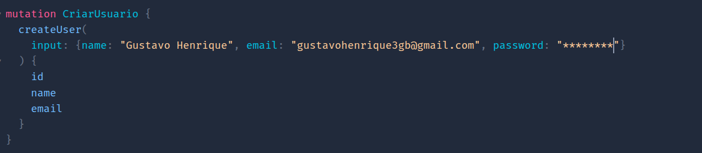
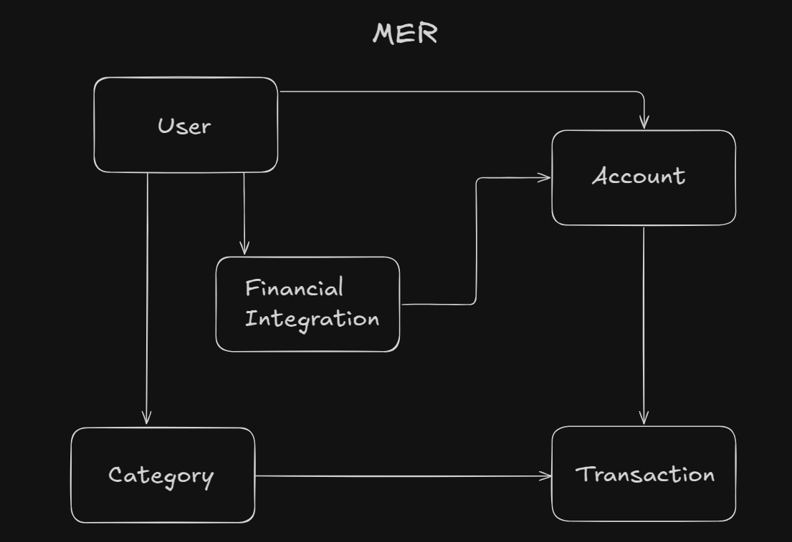

<h1 align="center">
    FinanceAPI
</h1>


<p align="center">
  
</p>

# API GraphQL de Integração Bancária, Análise e Classificação de Transações

A api foi construida com Java mas há também a versão Rest dela em [c#/.Net com o NestJS](https://github.com/GustavoDaMassa/dotNetFinaAPI)
## Apresentação

Está aplicação foi desenvolvida com a intenção de proporcionar o controle e gestão de ganhos e gastos. Nela, os usuários podem registrar suas transações e visualizá-las de acordo com suas caracteríscas. Com fim, de permitir uma análise detalhada e personalizada sobre as finanças.


A particularidade distintiva desta API reside no processo de classificação das transações financeiras. Com ela, é viável estabelecer categorias próprias, tornando o sistema flexível a personalizável a cada usuário. Ademais, a API traz a noção de detecção e armazenamento automático de movimentações financeiras através de Webhooks por meio de agregadores financeiros baseados em ***Open Finance***.

Usuários finais podem utilizá-la de forma pessoal, enquanto profissionais podem empregá-la como recurso para integrar dashboards e aplicações front-end.

---

## Motivação e Solução

A intenção inicial era construir um sistema integrado e funcional capaz de processar automaticamente as movimentações financeiras. Acontece que obter, classificar e analisar transações bancárias em tempo real é um processo que demanda alto nível de integração com instituições financeiras. No entando, o acesso direto a dados bancários reais exige a habilitação como instituição autorizada no Open Finance. Para seguir com o propósito, foi implementada uma solução utilizando um agregador de dados financeiros que oferece um ambiente sandbox, simulando o comportamento de uma instituição participante do Open Finance. Assim, foi possível simular webhooks, testando cenários reais sem depender de dados sensíveis.

Outro ponto relevante foi a escolha do GraphQL, que possibilita consultas flexíveis e precisas, retornando apenas os dados realmente necessários para cada cliente ou integração. Isso facilita a construção de dashboards dinâmicos e aplicações front-end, bem como a análise pessoal.

Além disso, a API permite a **categorização inteligente de transações**, possibilitando ao usuário final ou à aplicação selecionar apenas os lançamentos relevantes e calcular automaticamente o saldo para análise, filtragem ou integração com relatórios financeiros personalizados.

Entenda um pouco mais sobra a **[Pluggy](#pluggy)** e sobre o **[Ngrok](#ngrok)**

---


---

## Principais funcionalidades:

- Receber transações de forma automática via webhook Pluggy.
- Persistir transações em banco de dados relacional.
- Classificar por categorias personalizadas.
- Consultar histórico de transações.
- Visualizar transações de acordo com filtros- por categoria,por período e por tipo.
- Cálculo automático do saldo de acordo com as transações selecionadas.
---


## Fluxo princial:
#### fluxo de uso da API:

### **Users**:
- O usuário cria seu perfil se cadastrando no sistema.
### **Accounts**:
- o usuário pode criar e editar suas contas, ainda sem conexão com o agregador.
### **FinancialIntegration**:
- Com a conta criada é possível conectá-la com uma instituição financeira.
### **Category**:
- Usuários criam e gerenciam suas próprias categorias e subcategorias que poderão ser atribuídas à transações
### **Transactions**:
- Armazene e selecione as transações desejadas calculando automaticamente o saldo.

### Para compilar e navegar pelo no sistema siga para [como executar](#como-executar)

---

## Fluxo Webhook


- Através da plataforma do agregador Pluggy o cliente inicia uma aplicação e recebe as credencias de acesso que devem ser fornecidas à FinanceAPI em um requisição POST;

- Com a aplicação executando use o NGROK pra tunear a aplicação à uma URL pública com o comando ``` ngrok http localhost:8080 ```, e configure o webhook pela Pluggy com transaction/created;

- Ao criar um item automaticamente será enviado o webhook com o id do evento detectado;

- A aplicação recebe o evento e o envia ao kafka como producer;

- Como consumer a aplicação obtém a Api Key utilizando as credencias fornecidas e armazenadas em um arquivo ignorado pelo git, em sequência com a mensagem recebida do kafka realiza uma requisição GET à Pluggy, recuperando os dados equivalentes e persistindo no banco de dados.

## API Endpoints

### user-Resolver

#### Você pode criar, atualizar e deletar os usuários da aplicação, Email é único no sistema.

Exemplo: createUser(input: UserInput!): UserDTO



outras funcionalidades: 

````
type Mutation {
    createUser(input: UserInput!): UserDTO
    updateUser(id: ID!, input: UserInput!): UserDTO
    deleteUser(id: ID!): UserDTO
}

type Query {
    findUserByEmail(email: String!): UserDTO
    listUsers: [UserDTO!]!
}
````

---

### account-resolver

#### Contas podem, ser criadas vinculadas ou não a integrações existentes.

Exemplo: createAccount(input: AccountInput!): AccountDTO


Outras funcionalidades: 

````
extend type Mutation {
    createAccount(input: AccountInput!): AccountDTO
    updateAccount(id: ID!, input: AccountInput!): AccountDTO
    deleteAccount(id: ID!): AccountDTO
}

extend type Query {
    findAccountById(id: ID!): AccountDTO
    listAccountsByUser(userId: ID!): [AccountDTO!]!
}
````

---

### financialIntegration-resolver

#### Cria-se a integração financeira para receber webhook's vinculando usuários e contas.

Exemplo: createFinancialIntegration(input: FinancialIntegrationInput!, accountId: ID!): FinancialIntegrationDTO


Outras Funcionalidades:

````
extend type Mutation {
    createFinancialIntegration(input: FinancialIntegrationInput!, accountId: ID!): FinancialIntegrationDTO
    updateFinancialIntegration(id: ID!, input: FinancialIntegrationInput!): FinancialIntegrationDTO
    deleteFinancialIntegration(id: ID!): FinancialIntegrationDTO
}

extend type Query {
    findFinancialIntegrationById(id: ID!): FinancialIntegrationDTO
    listFinancialIntegrationsByUser(userId: ID!): [FinancialIntegrationDTO!]!
    listAccountsByIntegration(id: ID!): [AccountDTO!]!
}

````

---

### category-resolver

#### Usuários criam suas próprias categorias e subcategorias personalidazadas.

Exemplo: createCategory(input: CategoryInput!): CategoryDTO


Outras funcionalidades:

````
extend type Query {
    findCategoryById(id: ID!): CategoryDTO
    listCategoriesByUser(userId: ID!): [CategoryDTO!]!
}

extend type Mutation {

    createCategory(input: CategoryInput!): CategoryDTO
    updateCategory(id: ID!, input: CategoryInput!): CategoryDTO
    deleteCategory(id: ID!): CategoryDTO
}

````

---

### transaction-resolver

#### Transações além de inseridas, podem ser categorizadas de acordo com personalização no passo anterior, e selecionadas por período, por tipo(Entrada e Saida) e por categoria, assim como aquelas ainda não classificadas;

Exemplo: categorizeTransaction(id: ID!, categoryId: ID, subcategoryId: ID): TransactionDTO


Outras funcionalidades:

````
extend type Query {

    listUserTransactions(userId: ID!): TransactionListWithBalanceDTO!
    listAccountTransactions(accountId: ID!): TransactionListWithBalanceDTO!
    listTransactionsByPeriod(accountId: ID!, range: DateRangeInput!): TransactionListWithBalanceDTO!
    listTransactionsByType(accountId: ID!, type: TransactionType!): TransactionListWithBalanceDTO!
    listTransactionsByFilter(accountId: ID!, filter: TransactionFilterInput!): TransactionListWithBalanceDTO!
    listUncategorizedTransactions(accountId: ID!): [TransactionDTO!]!
}

extend type Mutation {

    createTransaction(input: TransactionInput!): TransactionDTO
    updateTransaction(id: ID!, input: TransactionInput!): TransactionDTO
    categorizeTransaction(id: ID!, categoryId: ID, subcategoryId: ID): TransactionDTO
    deleteTransaction(id: ID!): TransactionDTO
}

````

---

### Credential-Controller

#### Esse end-point é REST e recebe um metodo POST na rota ```localhost:8080/financeapi/credentials```

Request: 

```Json
{
  "clientId": "UUID-ClientID",
  "clientSecret": "UUID-ClientSecret"
}
```
Responde: 200-OK.

---

## Modelo de Dados



- Todas as relações apresentadas tem cardinalidade 1:N
  - Usuário possui N --> Contas;
  - Usuário possui N --> Categorias;
  - Usuário possui N --> Integrações financeiras;
  - Integração financeira possui N --> Contas;
  - Conta possui N --> Transações;
  - Categorias possui N --> Transações.

### **User**

| tipo  | dado     |
|-------|----------|
| Long  | id       |
| String | name     |
| String | email    |
| String | password |


### **Account**

| tipo            | dado         |
|-----------------|--------------|
| Long            | id           |
| String          | accountName  |
| String          | institution  |
| String          | type         |
| BigDecimal      | balance      |
| User (FK)       | user         |
| FinancialIntegration (FK) | integration |
| List<Transaction> | transactions |


### **Category**

| tipo            | dado         |
|-----------------|--------------|
| Long            | id           |
| String          | name         |
| User (FK)       | user         |
| Category (FK)   | parent       |
| List<Category>  | subcategories |


### **FinancialIntegration**

| tipo            | dado         |
|-----------------|--------------|
| Long            | id           |
| AggregatorType  | aggregator   |
| String          | linkId       |
| String          | status       |
| LocalDateTime   | createdAt    |
| LocalDateTime   | expiresAt    |
| User (FK)       | user         |
| List<Account>   | accounts     |


### **Transaction**

| tipo            | dado         |
|-----------------|--------------|
| Long            | id           |
| BigDecimal      | amount       |
| TransactionType | type         |
| String          | description  |
| String          | source       |
| String          | destination  |
| LocalDate       | transactionDate |
| Category (FK)   | category     |
| Category (FK)   | subcategory  |
| Account (FK)    | account      |
---

##  Tratamento de Exceções

A API retorna respostas padronizadas para erros e exceções. Abaixo estão os códigos de erro e suas descrições:

###  Exceções customizadas

| StatusCode | Exceção            | Error example                                |
|------------|--------------------|----------------------------------------------|
| 404        | `UserNotFoundException `  | User not found with Email: " + email         |
| 404        | `UserIDNotFoundException` | User not found with ID: " + id               |
| 400        | `EmailAlreadyExistException`    | The " + email + " is unavailable             |
| 400        | `InvalidTransactionTypeException`    | Invalid transaction type: " + type |
| 500        | `InternalServerError` | Internal Server Error          |

---


## Práticas Adotadas

- **Arquitetura e Design**
  - API GraphQL com divisão em camadas
  - Aplicação dos princípios SOLID
  - Injeção de Dependências
  - Uso do padrão Data Transfer Object (DTO)
  - Uso de ferramenta de Tuneamento (Ngrok)
  - Integração com modelo de dados de Api externas (Pluggy)
  - Mensageria com Kafka
  - armazenamento de credenciais em arquivos

- **Validação e Segurança**
  - Validações personalizadas e uso do Bean Validation
  - Implementação de autenticação por meu de X-API-KEY

- **Tratamento de Erros e Respostas**
  - Captura e tratamento de erros padronizados

- **Documentação**
  - Documentação da API com diagramas e exemplos
  - Documentação técnica dos endpoints com GraphiQL

- **Testes e Qualidade de Código**
  - Testes automatizados com criação de mocks e ambiente separado

- **Banco de Dados**
  - Modelagem do banco de dados relacional com definições de constraints
  - Consultas JPQL e SQL nativo com Spring Data JPA

- **Ferramentas e Deploy**
  - Uso de API Client, Database Client e Ambiente Sandbox durante o desenvolvimento
  - Encapsulamento da aplicação com Docker, criando imagens e containers personalizados
  - Versionamento de código com Git

### Tecnologias

- [Spring Boot](https://spring.io/projects/spring-boot)
- [Maven](https://maven.apache.org/)
- [Bean Validation](https://beanvalidation.org/)
- [Spring Security](https://docs.spring.io/spring-security/reference/index.html)
- [JUnit](https://junit.org/junit5/)
- [Postman](https://postman.com/)
- [Docker](https://www.docker.com/products/docker-hub/)
- [Git](https://git-scm.com/)
- [Spring WebClient](https://docs.spring.io/spring-framework/reference/web/webflux-webclient.html)
- [kafka](https://kafka.apache.org/)
- [GraphQL](https://graphql.org/)
- [Pluggy](https://pluggy.ai/)
- [PostgresQL](https://www.postgresql.org/)

---


## Como executar

A Aplicação utiliza o Docker e é disponibilizada dentro de um container com a imagem da api e do banco de dados ao qual se conecta.

#### Dependências:

- [Docker](#docker);
- [Docker Compose](#docker-compose).

### Opção 1


#### Passos para rodar:

- Clone o repositório e entre no diretório:
```
git clone https://github.com/GustavoDaMassa/FinanceAPI.git
cd FinanceAPI
```
- Suba o container com um imagem atualizada:
```
docker compose up --build -d 
```
- parando a aplicação:
```
docker compose down
```
### Opção 2
**caso deseje rodar com mais facilidade sem a necessidade de clonar o repositório**

- Baixe o arquivo  [docker compose](./Docker%20Compose%20/docker-compose.yaml)
- esse arquivo cria uma instância da aplicação de acordo com a versão mais recente presente no repositório [docker hub](https://hub.docker.com/r/gustavodamassa/finance-api/tags);
- **mantenha o nome do arquivo.**
- execute o seguinte comando na pasta em que o arquivo foi baixado
```
docker compose up
```
### Aplicação no ar

após executada você pode navegar por ela realizando requisições através do:
### - [GraphiQL](http://localhost:8080/graphiql)

- Para definir as credencias à simulação de webhook você deve fazer uma requisição POST, para ```localhost:8080/financeapi/credentials``` pelo API Client de sua preferência.

### Dependências

####  Docker:
Instalar conforme o sistema operacional:

- Linux (Ubuntu/Debian):

``` 
  sudo apt update && sudo apt install docker.io -y
```
```
  sudo systemctl enable --now docker
```

- Windows/Mac: Baixar e instalar o [Docker Desktop](https://www.docker.com/products/docker-desktop/).

####  Docker Compose:

- Linux
```
  sudo apt install docker-compose -y
```
- Windowns/mac: o Docker Compose já vem no Docker Desktop.

---


## Pluggy
A Pluggy é uma plataforma de integração financeira (Open Finance) que atua como agregadora de dados bancários e financeiros, permitindo que empresas e desenvolvedores acessem, em um único ponto, informações de contas bancárias, transações, saldos, investimentos e outros produtos financeiros de seus usuários finais — de forma segura, padronizada e com consentimento.

Ela simplifica a complexidade de lidar diretamente com instituições financeiras, oferecendo APIs unificadas para consultar e processar dados de múltiplos bancos e fintechs, tanto no Brasil (seguindo as diretrizes do Open Banking) quanto em outros mercados emergentes.

Uma das maiores vantagens da Pluggy é disponibilizar um ambiente sandbox, que permite que desenvolvedores testem suas integrações em um contexto simulado, sem necessidade de se tornarem uma instituição financeira regulada, tornando viável prototipar, validar e lançar produtos inovadores rapidamente.

[Site oficial Pluggy](https://pluggy.ai/)

---

## Ngrok

O ngrok é uma ferramenta que permite expor servidores locais para a internet de forma rápida, segura e prática, criando túneis HTTPS para aplicações rodando em sua máquina.

Ele é muito utilizado por desenvolvedores que precisam testar webhooks, aplicações web, APIs ou serviços que normalmente só estariam disponíveis na rede local. Com o ngrok, é possível gerar uma URL pública temporária, que redireciona as requisições externas diretamente para o seu servidor local, sem necessidade de configurar roteadores, abrir portas ou mexer em DNS.

Além de criar o túnel, o ngrok fornece painéis de monitoramento em tempo real, onde é possível inspecionar todas as requisições HTTP recebidas e as respostas enviadas, o que ajuda muito no debug e desenvolvimento de integrações externas, como sistemas de pagamento, notificações em tempo real ou integrações de APIs de terceiros que exigem endpoints acessíveis na internet.

[Site oficial Ngrok](https://ngrok.com/)

---


