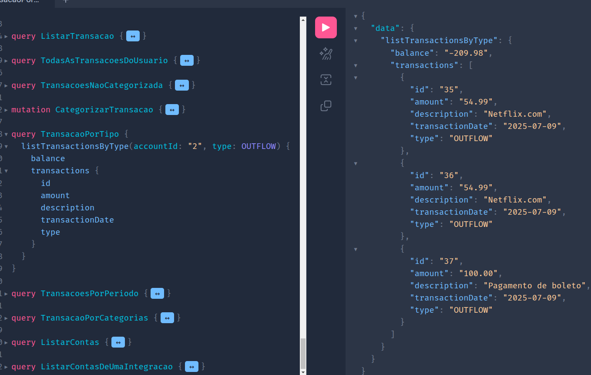
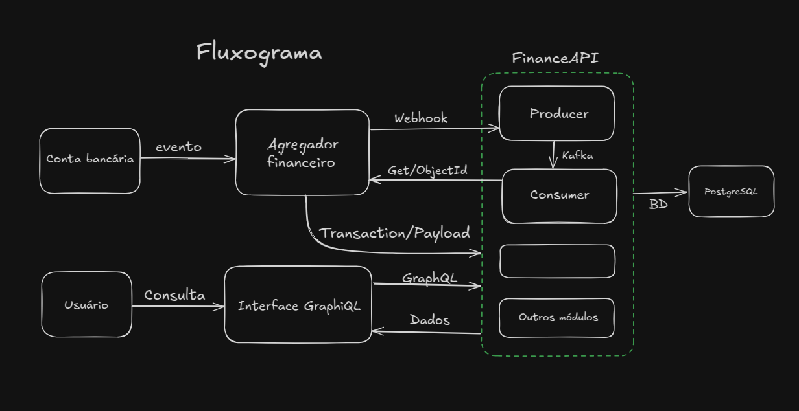
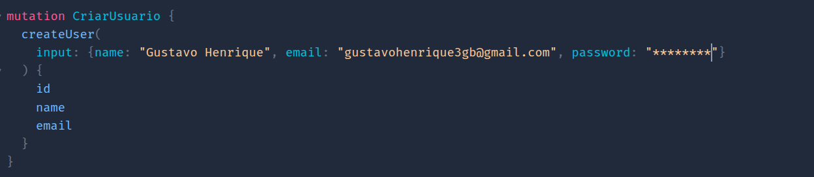
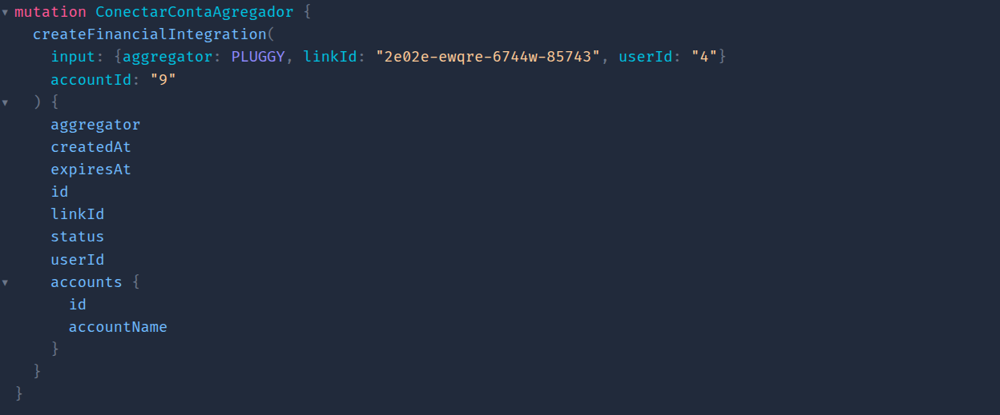
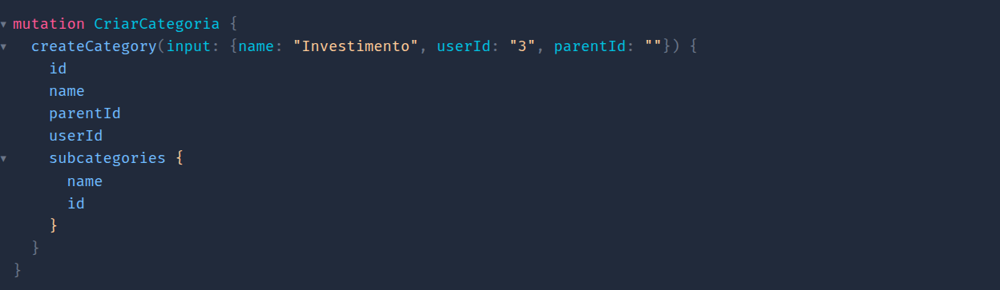
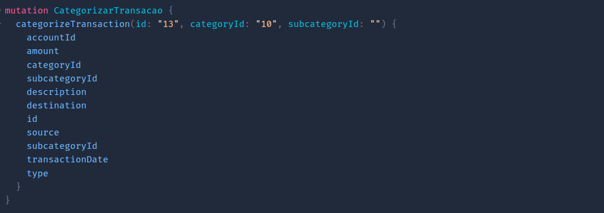
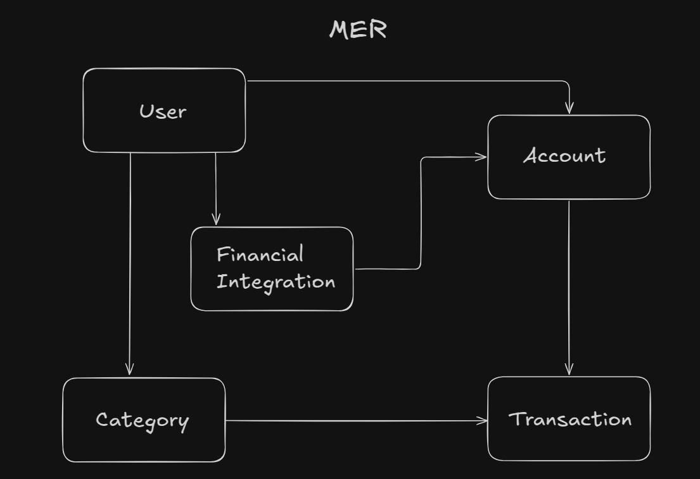

<h1 align="center">
    FinanceAPI
</h1>


<p align="center">
  
</p>

# GraphQL API for Banking Integration, Analysis and Transaction Classification

This API was built with Java, but there's also a REST version in [C#/.NET with NestJS](https://github.com/GustavoDaMassa/dotNetFinaAPI)

## Overview

This application was developed with the intention of providing control and management of income and expenses. In it, users can record their transactions and view them according to their characteristics, allowing for detailed and personalized financial analysis.

The distinctive feature of this API lies in the financial transaction classification process. With it, it's possible to establish custom categories, making the system flexible and personalizable for each user. Furthermore, the API brings the concept of automatic detection and storage of financial movements through Webhooks via financial aggregators based on ***Open Finance***.

End users can use it personally, while professionals can employ it as a resource to integrate dashboards and front-end applications.

---

## Motivation and Solution

The initial intention was to build an integrated and functional system capable of automatically processing financial transactions. However, obtaining, classifying, and analyzing banking transactions in real-time is a process that requires a high level of integration with financial institutions. However, direct access to real banking data requires being enabled as an authorized institution in Open Finance. To proceed with the purpose, a solution was implemented using a financial data aggregator that offers a sandbox environment, simulating the behavior of an institution participating in Open Finance. Thus, it was possible to simulate webhooks, testing real scenarios without depending on sensitive data.

Another relevant point was the choice of GraphQL, which enables flexible and precise queries, returning only the data actually needed for each client or integration. This facilitates the construction of dynamic dashboards and front-end applications, as well as personal analysis.

Additionally, the API allows for **intelligent transaction categorization**, enabling the end user or application to select only relevant entries and automatically calculate the balance for analysis, filtering, or integration with custom financial reports.

Learn more about **[Pluggy](#pluggy)** and **[Ngrok](#ngrok)**

---



---

## Main Features:

- Receive transactions automatically via Pluggy webhook.
- Persist transactions in a relational database.
- Classify by custom categories.
- Query transaction history.
- View transactions according to filters - by category, by period, and by type.
- Automatic balance calculation according to selected transactions.

---

## Production Features

The API has been prepared for production environments with security, observability, and reliability implementations:

### 🔐 Authentication and Security

#### **JWT (JSON Web Token)**
- Complete stateless authentication system with JWT tokens
- Configurable token expiration time (default: 24h)
- Passwords encrypted with BCrypt (robust hash algorithm)
- Protection against brute force attacks

**Authentication endpoints:**
- `POST /api/auth/login` - User authentication
- `POST /api/auth/create-admin` - Admin user creation (requires master key)

#### **Role System (Access Control)**
- **ADMIN**: Full system access, including sensitive operations
- **USER**: Access to own data and resources

**GraphQL endpoint protection:**
- All GraphQL resolvers protected with `@PreAuthorize`
- Administrative operations (delete users, list all) restricted to ADMIN
- Automatic permission validation via Spring Security

#### **CORS (Cross-Origin Resource Sharing)**
- Configuration of allowed origins for API access
- Support for credentials and custom headers
- Configurable via environment variables for production

### 📊 Observability and Monitoring

#### **Structured Logging (JSON)**
- Logs in JSON format compatible with ELK Stack (Elasticsearch, Logstash, Kibana)
- Automatic enrichment with context information:
  - `userId`: Authenticated user ID
  - `userEmail`: User email
  - `requestId`: Unique UUID per request (traceability)
  - `application`: Application name
- Asynchronous appenders for performance
- `X-Request-ID` header in responses for log correlation

#### **Spring Boot Actuator**
- Health and metrics endpoints for monitoring:
  - `/actuator/health` - Overall application status
  - `/actuator/health/liveness` - Liveness probe (Kubernetes)
  - `/actuator/health/readiness` - Readiness for traffic
  - `/actuator/metrics` - Application metrics
  - `/actuator/prometheus` - Metrics in Prometheus format

**Kubernetes integration:**
```yaml
livenessProbe:
  httpGet:
    path: /actuator/health/liveness
    port: 8080
readinessProbe:
  httpGet:
    path: /actuator/health/readiness
    port: 8080
```

### 📄 Query Pagination

Pagination system implemented for GraphQL queries that return large data volumes:

**New GraphQL types:**
- `PaginationInput`: Pagination control (page, size)
- `PageInfo`: Pagination metadata (currentPage, totalPages, hasNext, etc.)
- `TransactionPageDTO`: Paginated result with transactions and balance

**Available paginated queries:**
- `listAccountTransactionsPaginated` - Account transactions with pagination
- `listTransactionsByPeriodPaginated` - Transactions by period paginated
- `listTransactionsByTypePaginated` - Transactions by type paginated

**Defaults:**
- Default page: 0 (first page)
- Default size: 20 items
- Maximum size: 100 items per page

### 🔄 GraphQL Versioning

**Evolutionary API Design** strategy adopted for API evolution without breaking compatibility:

**Principles:**
- No URL versioning (/v1, /v2) - single `/graphql` endpoint
- Evolution via field deprecation with `@deprecated`
- Additive changes (new fields) don't break existing clients
- Gradual migration allowing clients to migrate at their own pace

**Deprecation example:**
```graphql
type Transaction {
  value: String! @deprecated(reason: "Use 'amount' for better precision")
  amount: BigDecimal!
}
```

**Migration process:**
1. **Deprecation** (3-6 months): Add new field, mark old as deprecated
2. **Migration** (3-6 months): Client support, usage monitoring
3. **Removal**: Only when deprecated field usage drops to 0%

### 🚀 CI/CD Pipeline

Automated pipeline with GitHub Actions for continuous integration and delivery:

**Implemented jobs:**

1. **build-and-test**
   - Java 21 setup
   - Maven dependency caching
   - Project build (`mvn clean install`)
   - Test execution (`mvn test`)
   - Coverage report generation (JaCoCo)
   - Test artifacts upload

2. **code-quality**
   - Validation with `mvn verify`
   - Runs after build-and-test

3. **security-scan**
   - Vulnerability scan with Trivy
   - Results upload to GitHub Security
   - Runs after build-and-test

**Triggers:**
- Push to branches: `main`, `develop`, `feature/**`
- Pull requests to: `main`, `develop`

### 🐳 Docker with Health Checks

Optimized Docker Compose configuration for reliability:

**Implemented health checks:**
- PostgreSQL: Verifies connection with `pg_isready`
- Kafka: Validates broker with `kafka-broker-api-versions`

**Conditional dependencies:**
- API only starts after PostgreSQL and Kafka are healthy
- Prevents connection errors on startup
- Ensures correct service initialization order

---

## Main Flow:
#### API usage flow:

### **Users**:
- The user creates their profile by registering in the system.

### **Accounts**:
- The user can create and edit their accounts, still without connection to the aggregator.

### **FinancialIntegration**:
- With the account created, it's possible to connect it with a financial institution.

### **Category**:
- Users create and manage their own categories and subcategories that can be assigned to transactions.

### **Transactions**:
- Store and select desired transactions, automatically calculating the balance.

### To compile and navigate through the system, go to [How to Run](#how-to-run)

---

## Webhook Flow



- Through the Pluggy aggregator platform, the client starts an application and receives access credentials that must be provided to FinanceAPI in a POST request;

- With the application running, use NGROK to tunnel the application to a public URL with the command `ngrok http localhost:8080`, and configure the webhook through Pluggy with transaction/created;

- When creating an item, the webhook will automatically be sent with the detected event id;

- The application receives the event and sends it to Kafka as a producer;

- As a consumer, the application obtains the API Key using the provided credentials stored in a file ignored by git, then with the message received from Kafka, makes a GET request to Pluggy, retrieving the equivalent data and persisting it in the database.

## API Endpoints

### user-Resolver

#### You can create, update, and delete application users. Email is unique in the system.

Example: createUser(input: UserInput!): UserDTO



Other features:

```graphql
type Mutation {
    createUser(input: UserInput!): UserDTO
    updateUser(id: ID!, input: UserInput!): UserDTO
    deleteUser(id: ID!): UserDTO
}

type Query {
    findUserByEmail(email: String!): UserDTO
    listUsers: [UserDTO!]!
}
```

---

### account-resolver

#### Accounts can be created linked or not to existing integrations.

Example: createAccount(input: AccountInput!): AccountDTO


Other features:

```graphql
extend type Mutation {
    createAccount(input: AccountInput!): AccountDTO
    updateAccount(id: ID!, input: AccountInput!): AccountDTO
    deleteAccount(id: ID!): AccountDTO
}

extend type Query {
    findAccountById(id: ID!): AccountDTO
    listAccountsByUser(userId: ID!): [AccountDTO!]!
}
```

---

### financialIntegration-resolver

#### Create financial integration to receive webhooks linking users and accounts.

Example: createFinancialIntegration(input: FinancialIntegrationInput!, accountId: ID!): FinancialIntegrationDTO



Other Features:

```graphql
extend type Mutation {
    createFinancialIntegration(input: FinancialIntegrationInput!, accountId: ID!): FinancialIntegrationDTO
    updateFinancialIntegration(id: ID!, input: FinancialIntegrationInput!): FinancialIntegrationDTO
    deleteFinancialIntegration(id: ID!): FinancialIntegrationDTO
}

extend type Query {
    findFinancialIntegrationById(id: ID!): FinancialIntegrationDTO
    listFinancialIntegrationsByUser(userId: ID!): [FinancialIntegrationDTO!]!
    listAccountsByIntegration(id: ID!): [AccountDTO!]!
}
```

---

### category-resolver

#### Users create their own customized categories and subcategories.

Example: createCategory(input: CategoryInput!): CategoryDTO



Other features:

```graphql
extend type Query {
    findCategoryById(id: ID!): CategoryDTO
    listCategoriesByUser(userId: ID!): [CategoryDTO!]!
}

extend type Mutation {
    createCategory(input: CategoryInput!): CategoryDTO
    updateCategory(id: ID!, input: CategoryInput!): CategoryDTO
    deleteCategory(id: ID!): CategoryDTO
}
```

---

### transaction-resolver

#### Transactions, in addition to being inserted, can be categorized according to previous customization, and selected by period, by type (Income and Expense), and by category, as well as those not yet classified;

Example: categorizeTransaction(id: ID!, categoryId: ID, subcategoryId: ID): TransactionDTO



Other features:

```graphql
extend type Query {
    listUserTransactions(userId: ID!): TransactionListWithBalanceDTO!
    listAccountTransactions(accountId: ID!): TransactionListWithBalanceDTO!
    listTransactionsByPeriod(accountId: ID!, range: DateRangeInput!): TransactionListWithBalanceDTO!
    listTransactionsByType(accountId: ID!, type: TransactionType!): TransactionListWithBalanceDTO!
    listTransactionsByFilter(accountId: ID!, filter: TransactionFilterInput!): TransactionListWithBalanceDTO!
    listUncategorizedTransactions(accountId: ID!): [TransactionDTO!]!
}

extend type Mutation {
    createTransaction(input: TransactionInput!): TransactionDTO
    updateTransaction(id: ID!, input: TransactionInput!): TransactionDTO
    categorizeTransaction(id: ID!, categoryId: ID, subcategoryId: ID): TransactionDTO
    deleteTransaction(id: ID!): TransactionDTO
}
```

---

### Credential-Controller

#### This endpoint is REST and receives a POST method at the route `localhost:8080/financeapi/credentials`

Request:

```json
{
  "clientId": "UUID-ClientID",
  "clientSecret": "UUID-ClientSecret"
}
```

Response: 200-OK.

---

## Data Model



- All relationships shown have 1:N cardinality
  - User has N --> Accounts;
  - User has N --> Categories;
  - User has N --> Financial Integrations;
  - Financial Integration has N --> Accounts;
  - Account has N --> Transactions;
  - Category has N --> Transactions.

### **User**

| Type   | Field    |
|--------|----------|
| Long   | id       |
| String | name     |
| String | email    |
| String | password |

### **Account**

| Type                      | Field        |
|---------------------------|--------------|
| Long                      | id           |
| String                    | accountName  |
| String                    | institution  |
| String                    | type         |
| BigDecimal                | balance      |
| User (FK)                 | user         |
| FinancialIntegration (FK) | integration  |
| List<Transaction>         | transactions |

### **Category**

| Type           | Field         |
|----------------|---------------|
| Long           | id            |
| String         | name          |
| User (FK)      | user          |
| Category (FK)  | parent        |
| List<Category> | subcategories |

### **FinancialIntegration**

| Type           | Field     |
|----------------|-----------|
| Long           | id        |
| AggregatorType | aggregator|
| String         | linkId    |
| String         | status    |
| LocalDateTime  | createdAt |
| LocalDateTime  | expiresAt |
| User (FK)      | user      |
| List<Account>  | accounts  |

### **Transaction**

| Type            | Field           |
|-----------------|-----------------|
| Long            | id              |
| BigDecimal      | amount          |
| TransactionType | type            |
| String          | description     |
| String          | source          |
| String          | destination     |
| LocalDate       | transactionDate |
| Category (FK)   | category        |
| Category (FK)   | subcategory     |
| Account (FK)    | account         |

---

## Exception Handling

The API returns standardized responses for errors and exceptions. Below are the error codes and their descriptions:

### Custom Exceptions

| StatusCode | Exception                        | Error example                       |
|------------|----------------------------------|-------------------------------------|
| 404        | `UserNotFoundException`          | User not found with Email: " + email|
| 404        | `UserIDNotFoundException`        | User not found with ID: " + id      |
| 400        | `EmailAlreadyExistException`     | The " + email + " is unavailable    |
| 400        | `InvalidTransactionTypeException`| Invalid transaction type: " + type  |
| 500        | `InternalServerError`            | Internal Server Error               |

---

## Adopted Practices

- **Architecture and Design**
  - GraphQL API with layered architecture
  - Application of SOLID principles
  - Dependency Injection
  - Use of Data Transfer Object (DTO) pattern
  - Use of Tunneling tool (Ngrok)
  - Integration with external API data models (Pluggy)
  - Messaging with Kafka
  - Credential storage in files

- **Validation and Security**
  - Custom validations and use of Bean Validation
  - Authentication implementation via X-API-KEY

- **Error Handling and Responses**
  - Standardized error capture and handling

- **Documentation**
  - API documentation with diagrams and examples
  - Technical documentation of endpoints with GraphiQL

- **Testing and Code Quality**
  - Automated tests with mock creation and separate environment

- **Database**
  - Relational database modeling with constraint definitions
  - JPQL and native SQL queries with Spring Data JPA

- **Tools and Deployment**
  - Use of API Client, Database Client, and Sandbox Environment during development
  - Application encapsulation with Docker, creating custom images and containers
  - Code versioning with Git

### Technologies

- [Spring Boot](https://spring.io/projects/spring-boot)
- [Maven](https://maven.apache.org/)
- [Bean Validation](https://beanvalidation.org/)
- [Spring Security](https://docs.spring.io/spring-security/reference/index.html)
- [JUnit](https://junit.org/junit5/)
- [Postman](https://postman.com/)
- [Docker](https://www.docker.com/products/docker-hub/)
- [Git](https://git-scm.com/)
- [Spring WebClient](https://docs.spring.io/spring-framework/reference/web/webflux-webclient.html)
- [Kafka](https://kafka.apache.org/)
- [GraphQL](https://graphql.org/)
- [Pluggy](https://pluggy.ai/)
- [PostgreSQL](https://www.postgresql.org/)

---

## How to Run

The application uses Docker and is available within a container with the API image and the database to which it connects.

#### Dependencies:

- [Docker](#docker);
- [Docker Compose](#docker-compose).

### Option 1

#### Steps to run:

- Clone the repository and enter the directory:
```bash
git clone https://github.com/GustavoDaMassa/FinanceAPI.git
cd FinanceAPI
```

- Start the container with an updated image:
```bash
docker compose up --build -d
```

- Stopping the application:
```bash
docker compose down
```

### Option 2
**If you want to run more easily without the need to clone the repository**

- Download the [docker compose](./Docker%20Compose%20/docker-compose.yaml) file
- This file creates an instance of the application according to the most recent version present in the [docker hub](https://hub.docker.com/r/gustavodamassa/finance-api/tags) repository;
- **Keep the file name.**
- Run the following command in the folder where the file was downloaded:
```bash
docker compose up
```

### Application Running

After execution, you can navigate through it by making requests via:
### - [GraphiQL](http://localhost:8080/graphiql)

- To set credentials for webhook simulation, you must make a POST request to `localhost:8080/financeapi/credentials` using your preferred API Client.

### Dependencies

#### Docker:
Install according to the operating system:

- Linux (Ubuntu/Debian):

```bash
sudo apt update && sudo apt install docker.io -y
```
```bash
sudo systemctl enable --now docker
```

- Windows/Mac: Download and install [Docker Desktop](https://www.docker.com/products/docker-desktop/).

#### Docker Compose:

- Linux
```bash
sudo apt install docker-compose -y
```
- Windows/Mac: Docker Compose comes with Docker Desktop.

---

## Pluggy

Pluggy is a financial integration platform (Open Finance) that acts as an aggregator of banking and financial data, allowing companies and developers to access, in a single point, information from bank accounts, transactions, balances, investments, and other financial products of their end users — securely, standardized, and with consent.

It simplifies the complexity of dealing directly with financial institutions, offering unified APIs to query and process data from multiple banks and fintechs, both in Brazil (following Open Banking guidelines) and in other emerging markets.

One of Pluggy's biggest advantages is providing a sandbox environment, which allows developers to test their integrations in a simulated context, without needing to become a regulated financial institution, making it viable to prototype, validate, and launch innovative products quickly.

[Official Pluggy Website](https://pluggy.ai/)

---

## Ngrok

Ngrok is a tool that allows you to expose local servers to the internet quickly, securely, and practically, creating HTTPS tunnels for applications running on your machine.

It is widely used by developers who need to test webhooks, web applications, APIs, or services that would normally only be available on the local network. With ngrok, it's possible to generate a temporary public URL, which redirects external requests directly to your local server, without the need to configure routers, open ports, or mess with DNS.

In addition to creating the tunnel, ngrok provides real-time monitoring panels, where it's possible to inspect all HTTP requests received and responses sent, which greatly helps in debugging and developing external integrations, such as payment systems, real-time notifications, or third-party API integrations that require endpoints accessible on the internet.

[Official Ngrok Website](https://ngrok.com/)

---
